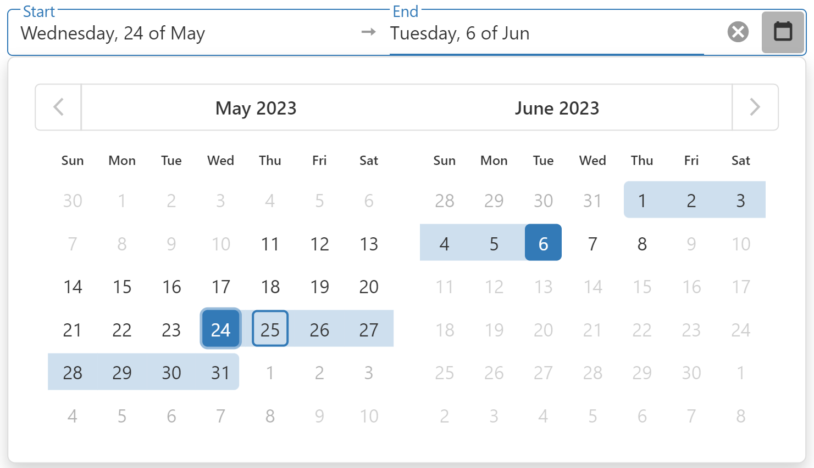

<!-- default badges list -->

<!-- default badges end -->

# DevExtreme DateRangeBox - Getting Started 

This repository stores the code examples of the DateRangeBox component for the [Getting Started with DateRangeBox](https://js.devexpress.com/Documentation/Guide/UI_Components/DateRangeBox/Getting_Started_with_DateRangeBox/) tutorial. The DateRangeBox is a UI component that displays date in a specified range, and enables a user to pick or type in the required date range values. This tutorial shows how to configure the basic DateRangeBox features.

## Files to Review

- **Angular**
    - [app.component.html](angular/src/app/app.component.html)
    - [app.component.ts](angular/src/app/app.component.ts)
- **jQuery**
    - [index.js](jquery/src/index.js)
- **React**
    - [App.js](react/src/App.js)
- **Vue**
    - [App.vue](vue/src/App.vue)

## Documentation

- [Getting Started with DateRangeBox](https://js.devexpress.com/Documentation/Guide/UI_Components/DateRangeBox/Getting_Started_with_DateRangeBox/)

- [DateRangeBox - API Reference](https://js.devexpress.com/Documentation/ApiReference/UI_Components/dxDateRangeBox/)
