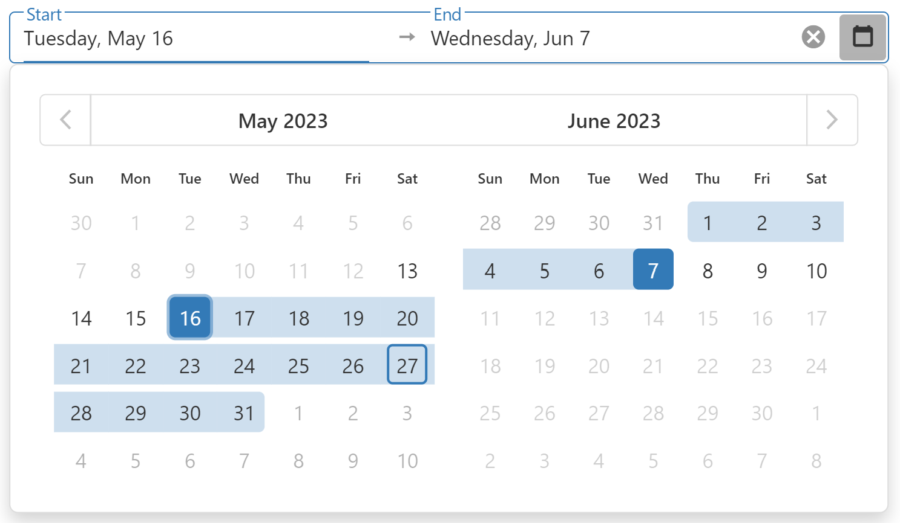

<!-- default badges list -->

<!-- default badges end -->

# DevExtreme DateRangeBox - Getting Started 

This repository includes full source code for the Getting Started with [Getting Started with DateRangeBox](https://js.devexpress.com/Documentation/Guide/UI_Components/DateRangeBox/Getting_Started_with_DateRangeBox/) tutorial. 

Our DateRangeBox UI component displays date values within a specified range. It allows users to select dates using the component’s built-in calendar or to enter values manually. 

The Getting Started with DateRangeBox tutorial demonstrates how you can configure the DateRangeBox and incorporate some of its many features within your next web app.

## Files to Review

- **Angular**
    - [app.component.html](angular/src/app/app.component.html)
    - [app.component.ts](angular/src/app/app.component.ts)
- **jQuery**
    - [index.js](jquery/src/index.js)
- **React**
    - [App.js](react/src/App.js)
- **Vue**
    - [App.vue](vue/src/App.vue)

## Documentation

- [Getting Started with DateRangeBox](https://js.devexpress.com/Documentation/Guide/UI_Components/DateRangeBox/Getting_Started_with_DateRangeBox/)

- [DateRangeBox - API Reference](https://js.devexpress.com/Documentation/ApiReference/UI_Components/dxDateRangeBox/)
<!-- feedback -->
## Does this example address your development requirements/objectives?

 

(you will be redirected to DevExpress.com to submit your response)
<!-- feedback end -->
